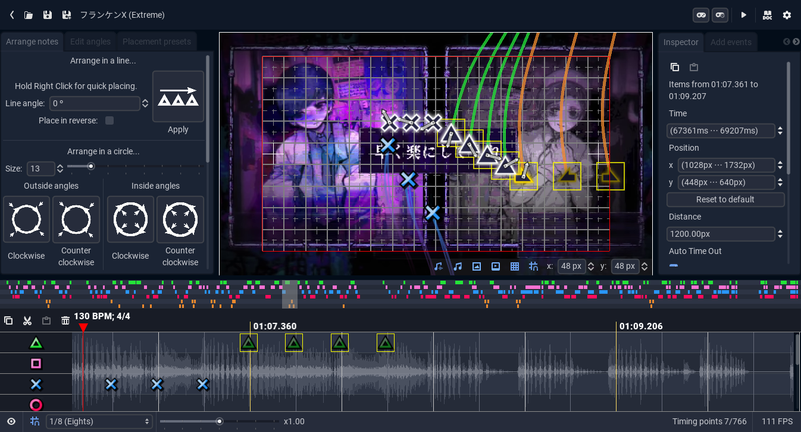
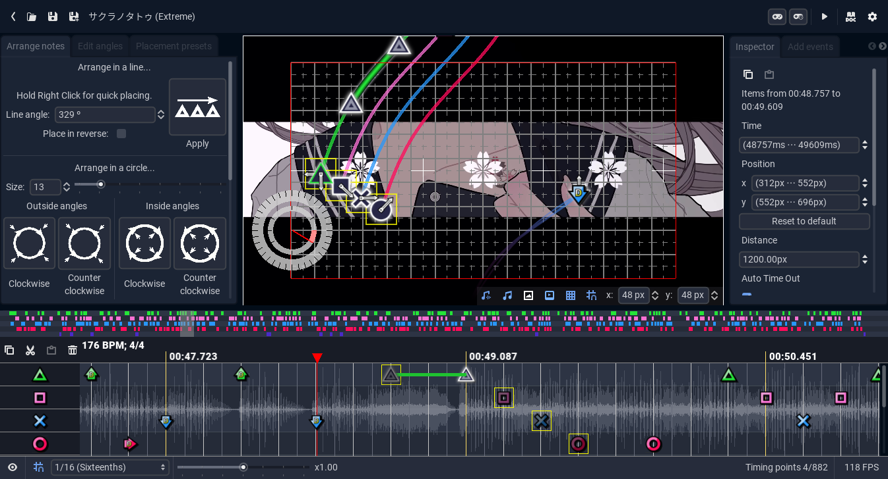

# Introduction

Welcome to the **PH Editor Reference Manual**. Here, you will find all the information related to the Chart Editor that is included with [Project Heartbeat](https://ph.eirteam.moe/) (or *PH* for short), a Rythm Game inspired by the Project Diva series.

The editor supports both ***Console*** (with *Doubles*, *Sustains* and *Hearts*) and ***Arcade*** (with *Multinotes*, *Holds* and *Slides*) charting. Mixing both is possible, but discouraged outside of expert use.

# Help
If you need help, have any questions, or just want to talk to people about the editor and chart design, feel free to take a look at the [Project Heartbeat Discord Server](https://discord.gg/project-heartbeat-640872911678341130). We are a welcoming community and love to talk about this kind of stuff.
*Bug Reports* and *Feature Requests* are also appreciated. Your feedback is what makes the game better!

# Contributing
The editor is not (currently) open source. However, you can contribute to this guide by opening a [Pull Request](https://github.com/LinoBigatti/ph-editor-reference/pulls) on [Github](https://github.com/LinoBigatti/ph-editor-reference). You can also contribute to the game by submitting *Bug Reports* and *Feature Requests* on [Discord](https://discord.gg/project-heartbeat-640872911678341130)

# License
This guide is released under the [GNU Affero General Public License 3.0](https://www.gnu.org/licenses/agpl-3.0.txt). Scripts interacting with the [Project Heartbeat API](./developer/scripts_and_expressions/scripts.md) are also automatically licensed under the *AGPLv3*, alongside a *Royalty-Free License* for [EIRTeam](https://ph.eirteam.moe/contact) to incorporate it into the game.

