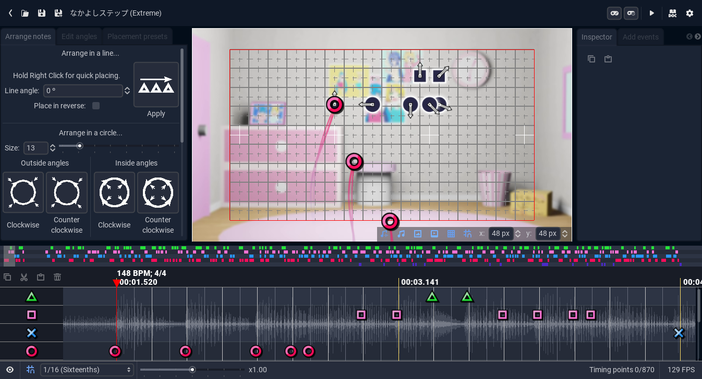
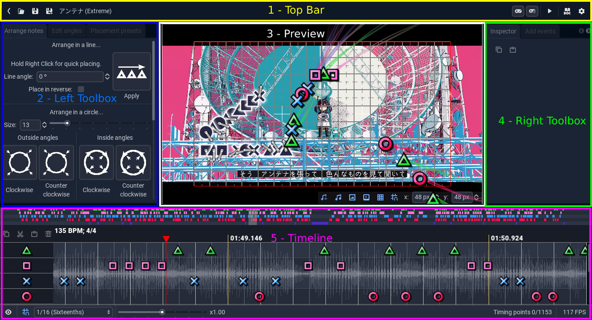
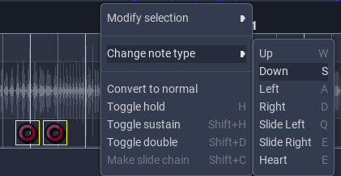

# Anatomy of the Editor

The first thing you will see when you open the editor is the [Chart Manager](chart_manager/index.md). If you open a chart, then you will be greeted by the main editor window.

From here, you can see the 5 main areas of the editor:

They are, in order:
1. The [***Top Bar***](#the-top-bar)
2. The [***Left Toolbox***](#the-left-toolbox)
3. The [***Preview***](#the-preview)
4. The [***Right Toolbox***](#the-right-toolbox)
5. The [***Timeline***](#the-timeline)

Inbetween these areas, there are *draggable separations*. You can resize each part and it will save this layout.

## The Top Bar

The Top Bar is composed of 2 sections: The left side and the right side.

### The left side

On the left side, we have a few buttons and some info. They are, in order:
* The exit button
* [The open chart button](chart_manager/index.md)
* [The save buttons](saving.md)
* The song name
* The difficulty

### The right side

On the right side, we can find, in order:
* [The playtest (and playtest at time) buttons](chart_preview/playtest.md)
* [The preview play/pause button](chart_preview/index.md)
* The documentation links (which point to [this very manual](https://linobigatti.github.io/ph-editor-reference/))
* [The settings button](settings/index.md)

## The Left Toolbox

The Left Toolbox is composed of 3 *Modules* which are responsible for some of the most common operations in the editor. They are, in order:
* [The Arrange Module](arrange_module/index.md)
* [The Angles Module](angles_module/index.md)
* [The Presets Module](presets/index.md)

You can select between them by clicking the corresponding *Tab* on the top of the toolbox.

## The Right Toolbox

The Right Toolbox is also composed by various *Modules*, which house some less frequently used, but way more powerful tools. They are, in order:
* [The Inspector](inspector/index.md)
* [The Events Module](events/index.md)
* [The Sync Module](timeline/sync.md)
* [The Script Manager](scripts.md)
* [The Chart Importer](imports/index.md)

You can also select them by clicking on its corresponding *Tab*.

## The Preview

The Chart Preview is one of the most useful tools in the whole Editor. It is what allows us to see, in real time, how our chart will look. It houses various buttons and toggles in its bottom right corner, which are:
* [The Waveform Toggle](timeline/index.md#waveform)
* [The SFX Toggle](chart_preview/index.md#sound-effects)
* [The video/BG Toggles](chart_preview/index.md#video-and-background-art)
* [The Grid and Grid snap Toggles](chart_preview/grid.md)

It also allows the charter to [place](arrange_module/preview_tools.md) and [arrange](arrange_module/arrange_wheel.md) notes, and to [edit their angles](angles_module/preview_tools.md).

## The Timeline

The Timeline is the tool used to look at the chart in full, and managing all of the notes. it is composed of 3 main parts:

### The Minimap

The Minimap shows a small view of the whole chart, with a *translucent rectangle* which can be used to quickly move through the chart.

### The Layers

This is the main Timeline view. You can use it to [create notes](timeline/creation_and_selection.md), [select them](timeline/creation_and_selection.md) or [cut, copy and paste them](timeline/move_selection.md). It also allows you to [see and edit the tempo map](timeline/sync.md), and a variety of other operations through the contextual menu.

### The Footer
The Timeline Footer is divided in 2 parts: The *left side* and the *right side*.

The left side contains a button to open the [layer manager](settings/local.md#layers), a button to [toggle timeline snap](timeline/sync.md#snap), a dropdown to select a [timeline resolution](timeline/sync.md#snap) and the [speed slider](chart_preview/speed_controls.md).

The right side contains a **note counter**, and an **FPS counter**.

# The different controls

The editor is primarily made up of some basic control nodes, which have some **special properties**. They are:
* ***Buttons***: These have a hint when you hover over them, which contains some help on how to use it and the corresponding [shortcut](settings/shortcuts.md)
    * ***Toggle Buttons***: These are Buttons that conserve their state, so instead of pressing them you can *toggle them on and off*. When a Toggle Button is white, it means that its *Off*, and when its light blue its *On*.
* ***Line Edits***: These allow you to input a *single line of text*. Pressing *Enter* will accept the changes, and pressing *Esc* or pressing outside of the control will reject them.
    * ***Spinboxes***: They are like Line Edits, but they *only allow numerical values*. You can also run [expressions](../developer/scripts_and_expressions/expressions.md) on them. They may **impose some bounds** on the values you input. They also have some arrows to **increase and decrease the values**.
        * ***Multi Spinboxes***: These work similarly to Spinboxes, but have some extra features to work with multiple values at once. You can read more about them [here](inspector/editing.md).
    * ***Text Edits***: This works like a Line Edit, but it *allows you to input multiple lines*. Therefore, *Enter* will just add a new line.
        * ***Code Edits***: These are like Text Edits, but they have syntax highligthing for [scripts](../developer/scripts_and_expressions/scripts.md) and a miniature version of the code on the right.
