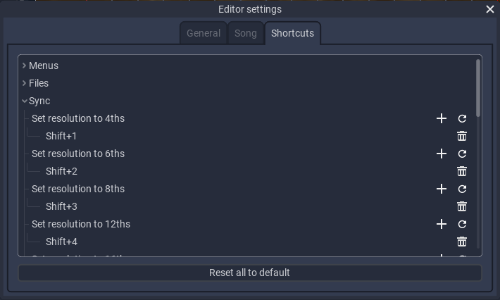

# Shortcuts

The Editor has a very extensive list of ***Keyboard Shortcuts***, which can be used to do common operations very fast, increasing productivity. There is a shortcut for almost every button in the editor, alltough not all of them are *set by default*.
Shortcuts are in no way mandatory, and a lot of the things you can do with them have manual versions. This said, it is very useful to learn at least the ones for the things you do most commonly.

## The Shortcuts Manager

In the settings tab lies the ***Shortcut Manager***, which is used to view and edit shortcuts. In it, you will see a list of all the categories, which you can open to reveal the list of shortcuts, alongside of a brief description of what they do. You will also see a button to **reset all shortcuts**.

Each entry corresponds to an *action*, and it has the name of the action in the top row. Below it there is a list of all the shortcuts that are *assigned to this action*.

Pressing the *plus icon* will open a dialog to **add a new shortcut** to this action. *Double clicking* on an assigned shortcut will open a similar dialog to **edit it**. You can press any key combination or mouse button to set the new shortcut. Once you are done, press *OK*.

The valid types of shortcuts are:
* A *key*
* A *mouse button* (wheel up/down counts)[^valid_shortcuts_note]
* One of the above, combined with **one or more** of *Control*, *Shift*, *Alt* or *Meta* (The windows key on most keyboards)

If you assign the same shortcut to 2 different actions, the text will be *red*[^conflicting_bindings_note].

If you still want to proceed, it will let you choose between *adding the shortcut anyways*, *removing the binding from other actions* and *going back*.

Pressing the *trash icon* will **remove the selected shortcut**, and pressing the *reset icon* will **reset this action to its default mapping**.

## The Shortcut Map

There are a lot of *default bindings* in the editor. Here, you can navigate a map of them, to familiarize yourself with their usage. Keep in mind that not knowing every single one of these is in no way a problem when charting, but this reference is useful even if you dont use most of them.

To navigate the map, hover over a key, which will show a tooltip with the action it corresponds to. You can also click on the *modifier keys* (or hold them on your physical keyboard) to show the commands related to them.

You can ***filter the shortcuts by category*** by using the dropdown in the left. With the middle textbox you can ***search shortcuts***, and the rightmost icons and dropdown are used to ***select the shape and layout of the keyboard***.

<!-- Shortcut Mapper code -->
<link href="/ph-editor-reference/ShortcutMapper/content/stylesheets/style.css" rel="stylesheet">

    

        <select id="context_select" name="context_select" class="chosen-select" title="Filter Shortcuts"></select>
    

    

        

            

                <input id="searchfield" name="searchfield" placeholder="Search for shortcuts..." />
                
                

            

        

        

    

    

        <!-- leave no spaces between buttons -->
        <button id="os_windows" class="os-radiobutton os-windows leftfield" data-os="windows" title="Display a Windows keyboard"><b></b>
        </button><button id="os_osx" class="os-radiobutton os-mac midfield" data-os="mac" title="Display a Mac keyboard"><b></b>
        </button><button id="os_linux" class="os-radiobutton os-linux rightfield" data-os="windows" title="Display a Linux keyboard"><b></b></button>
    

    

        <select id="keyboardtype_select" name="keyboardtype_select" class="chosen-select keyboard-select" title= "Set the keyboard layout"></select>
    

    

    

        

            

        

    

<!-- End of Shortcut Mapper code -->

[^valid_shortcuts_note]: Some actions with originally keyboard-only bindings dont work when setting a mouse binding, and viceversa. We are trying to fix this, so if you find such a case, please report it!

[^conflicting_bindings_note]: Not all actions conflict with each other. Some actions will never interfere with some others, so they are hard-coded as non-conflicting.
